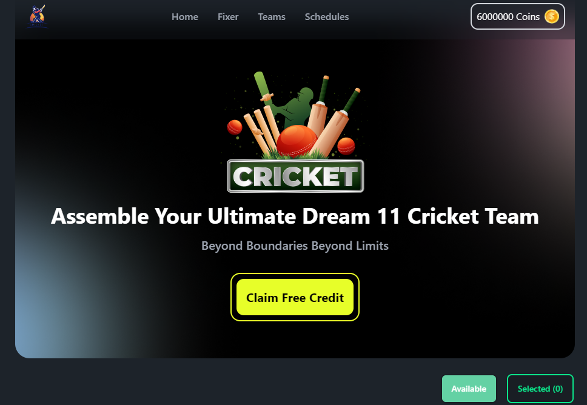
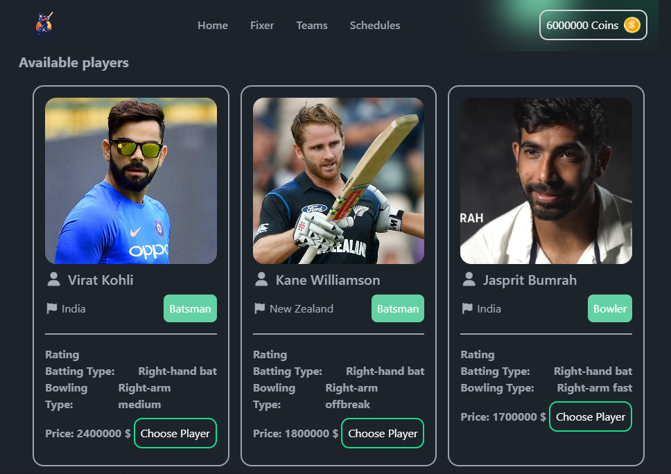
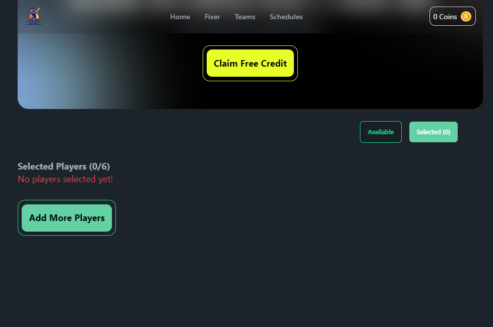
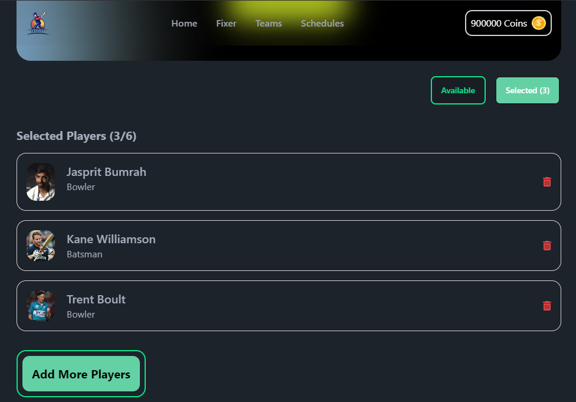
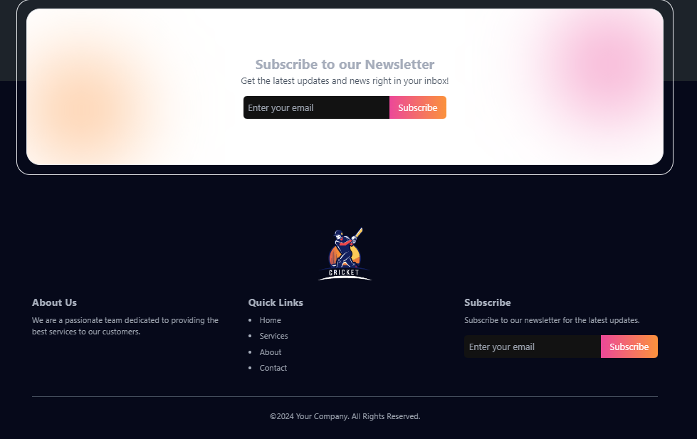

# DREAM 11

Welcome to **DREAM 11**, a React-based application that allows users to select and manage cricket players for their fantasy team. This application follows a modern design inspired by Figma, providing a responsive and user-friendly interface for cricket enthusiasts.

## Technologies Used

<table>
    <tr>
        <td>
            <a href="#"></a>
        </td>
        <td>
            <a href="#"></a>
        </td>
    </tr>
</table>

## Sneak Peek of Home Page 🙈 : [Go Live](https://dream11-06.netlify.app/)


<table>
  <tr>
    <td></td>
    <td></td>
  </tr>
  <tr>
    <td></td>
    <td></td>
  </tr>
</table>

## Description

DREAM 11 enables users to build their dream cricket team by selecting players while managing their budget. Users can view available players, select their favorites, and remove players from their selection. The application includes a responsive navbar, an attractive banner, and a newsletter section for user engagement.

## Key Features

1. **Dynamic Player Selection**:

   - Users can browse through a list of cricket players presented in an attractive card layout.
   - Each player card displays essential information such as name, country, role, batting/bowling type, and bidding price.
   - A "Choose Player" button allows users to select players while ensuring they have enough coins. The application notifies users if they try to select a player without sufficient funds.

2. **Responsive Design**:

   - The entire application is built with a mobile-first approach, ensuring it looks great on devices of all sizes.
   - The navbar, banner, and player sections are designed to adapt seamlessly to different screen resolutions.
   - Features like toggling between available and selected players enhance usability on both mobile and desktop devices.

3. **User Notifications with React-Toastify**:

   - All user alerts and notifications are managed using React-Toastify, providing a smoother and more visually appealing user experience.
   - Notifications inform users of successful actions (like player selection) or errors (like insufficient funds or trying to select a player already in the team), improving overall interaction and feedback.

4. **Player Management and Validation**:

   - Users can manage their selected players efficiently, with the ability to remove players from their selection easily.
   - The application includes validation checks to prevent users from exceeding the maximum player limit (6 players) and from selecting the same player multiple times.

5. **Attractive UI and Layout**:
   - The application features a well-designed banner with an eye-catching call-to-action button, encouraging users to earn coins.
   - The footer section is designed to match the overall aesthetic of the application, providing useful links and information.

## Getting Started

To get started with the project, clone the repository and install the necessary dependencies:

```bash
git clone https://github.com/Crypt06545/AS-7-dream-11.git

npm install
npm run dev
```
